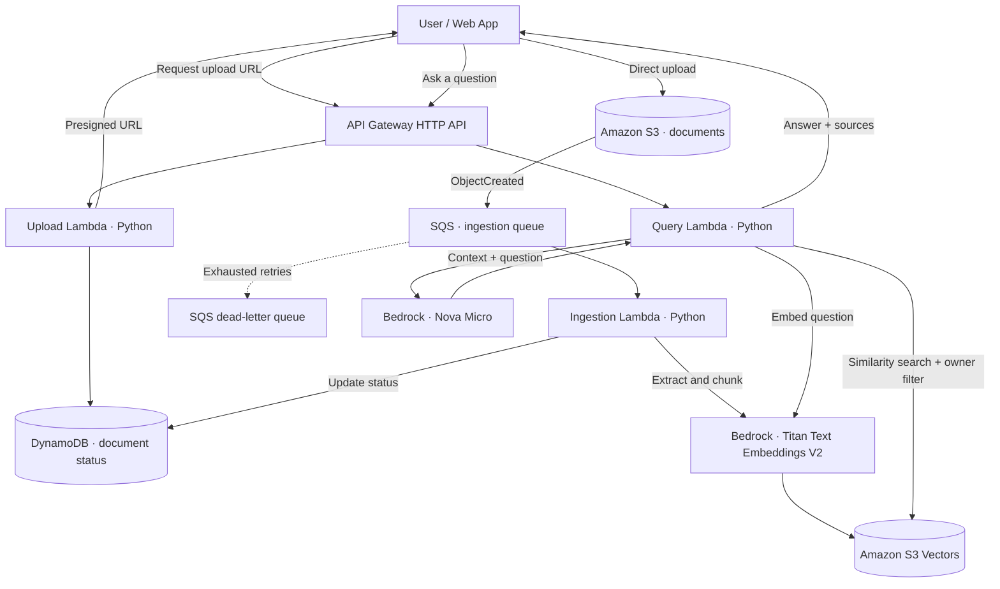

<div align="center">

# quivecta

### Serverless Document Intelligence Platform

**Ask your documents. Get answers grounded in your knowledge.**

A serverless, event-driven Retrieval-Augmented Generation (RAG) application on AWS. Upload documents, turn their content into searchable embeddings, and ask natural-language questions with source references.

**Python · AWS Lambda · Amazon S3 · Amazon SQS · S3 Vectors · Amazon Bedrock · API Gateway · DynamoDB**

</div>

> **Project status: In development.** The API upload flow, S3 upload, SQS-triggered ingestion, and DynamoDB status updates have been tested. End-to-end embedding and question answering remain unverified while Amazon Bedrock account access is under verification. The frontend and Cognito integration are planned/being integrated; do not treat the features below as all production-ready.

## Overview

quivecta helps users work with their own documents without manually searching through pages of text. Instead of answering from a general-purpose model alone, it retrieves relevant excerpts from uploaded files and uses those excerpts as context for a response.

**Typical workflow:**

1. Upload a PDF, TXT, or Markdown document.
2. S3 notifies SQS that a new file has arrived.
3. A Python Lambda extracts and chunks the text.
4. Amazon Bedrock converts chunks into vector embeddings.
5. Amazon S3 Vectors indexes the embeddings and document metadata.
6. Ask a question via the API; the query Lambda retrieves relevant chunks and generates an answer with source references.

## Architecture



**Region layout for the current build:** AWS application infrastructure in **`ap-southeast-1` (Singapore)**; Bedrock model inference in **`ap-southeast-2` (Sydney)**. Confirm model availability and permissions for your account before deployment. Documents and vector indexes remain in Singapore, but text sent to Bedrock is processed in the model Region.

## Technology stack

| Layer | AWS service / tool | Responsibility |
| --- | --- | --- |
| Frontend | HTML, CSS, JavaScript; S3 + CloudFront (planned) | Upload, status, document Q&A |
| Authentication | API Gateway AWS_IAM (current test); Cognito JWT (planned) | Protect API routes |
| HTTP API | API Gateway HTTP API | Upload and question endpoints |
| Compute | AWS Lambda, Python 3.12, Boto3 | API handlers and ingestion workers |
| File storage | Amazon S3 | Original uploaded documents |
| Messaging | Amazon SQS + DLQ | Asynchronous processing and retries |
| Embeddings | Amazon Bedrock, Titan Text Embeddings V2 | Document/question vectors, 512 dimensions |
| Vector search | Amazon S3 Vectors | Similarity search and metadata filtering |
| Generation | Amazon Bedrock, Nova Micro | Grounded answer generation |
| Metadata | Amazon DynamoDB | Document ownership and indexing status |
| Observability | Amazon CloudWatch | Logs, metrics, and alarms |
| Infrastructure as Code | Terraform (planned) | Reproducible infrastructure |

## Features

- **Direct document uploads:** presigned S3 URLs avoid proxying file bytes through API Gateway.
- **Event-driven ingestion:** S3 events are buffered by SQS and processed by Lambda.
- **Semantic document search:** embeddings and approximate similarity lookup through S3 Vectors.
- **Grounded Q&A:** responses use retrieved context and include source references.
- **Document status tracking:** `UPLOADING`, `PROCESSING`, `READY`, and `FAILED`.
- **Retry handling:** SQS delivery/retries and a dead-letter queue for failed jobs.
- **Low idle infrastructure cost:** on-demand services rather than continuously running servers.

**Current MVP limits:** PDF (text-based), TXT, and MD; a 2 MB upload cap; up to 60 extracted chunks per document; five retrieved chunks per question. Scanned PDFs need OCR, which is not implemented in the initial version.

## API endpoints

| Method | Endpoint | Purpose | Lambda |
| --- | --- | --- | --- |
| `POST` | `/uploads` | Get a presigned URL and document ID | `rag-upload` |
| `GET` | `/documents/{id}` | Check indexing status | `rag-upload` |
| `POST` | `/ask` | Ask a question and retrieve a grounded response | `rag-ask` |

All MVP routes require **AWS_IAM** authorization. Requests must be signed with AWS Signature Version 4. Cognito JWT-based access is a planned frontend integration.

### Example: request an upload URL

Request:

```json
{
  "filename": "incident-response-policy.pdf",
  "size": 142000
}
```

Example response:

```json
{
  "document_id": "example-document-id",
  "upload_url": "https://<presigned-s3-url>",
  "status": "UPLOADING"
}
```

Upload the file directly to the returned S3 URL using an HTTP `PUT` request. The S3 upload triggers processing asynchronously.

### Example: check document status

```http
GET /documents/example-document-id
```

```json
{
  "document_id": "example-document-id",
  "filename": "incident-response-policy.pdf",
  "status": "READY"
}
```

### Example: ask a question

Request:

```json
{
  "question": "How quickly must critical incidents be acknowledged?"
}
```

Illustrative response:

```json
{
  "answer": "Critical incidents must be acknowledged within 5 minutes. [1]",
  "sources": [
    {
      "reference": 1,
      "document_id": "example-document-id",
      "filename": "incident-response-policy.pdf",
      "chunk": 0
    }
  ]
}
```

> The response is an example of the intended format, not a claim that Bedrock generation has already passed end-to-end testing.

## Suggested repository structure

```text
quivecta/
├── README.md
├── src/
│   ├── upload.py             # Presigned URL + document status
│   ├── ingest.py             # SQS document-processing worker
│   └── ask.py                # Retrieval + answer generation
├── frontend/                 # Static web app (planned)
├── tests/
│   └── test_api.py           # Signed end-to-end API smoke test
├── infra/                    # Terraform modules (planned)
└── .github/workflows/        # CI/CD (planned)
```

This is the **target layout**, not a claim that every directory is already present. Existing functions can be exported from the AWS Lambda console into `src/`.

## Getting started

### Prerequisites

- AWS account with the necessary IAM permissions and Bedrock inference access
- AWS CLI v2 configured with a deployment/testing identity
- Python 3.12 and Boto3
- Application AWS Region: `ap-southeast-1`
- Bedrock model Region: `ap-southeast-2` (for this deployment)
- S3 document bucket, S3 Vectors bucket/index, SQS queue + DLQ, DynamoDB table
- Three **standard** Lambda functions (`rag-upload`, `rag-ingest`, `rag-ask`) and their execution roles
- API Gateway HTTP API configured with integrations and authorization

**Note:** Use standard Lambda functions for this implementation. Lambda durable execution requires a different invocation/configuration approach and isn't needed for SQS-based ingestion.

### 1. Configure your AWS CLI

```bash
aws sts get-caller-identity
export AWS_REGION=ap-southeast-1
export AWS_DEFAULT_REGION="$AWS_REGION"
export BEDROCK_REGION=ap-southeast-2
```

### 2. Configure application resources

Set the following values in the appropriate Lambda environment variables or configuration code:

```dotenv
DOC_BUCKET=<your-document-s3-bucket>
TABLE_NAME=rag-documents
VECTOR_BUCKET=<your-s3-vector-bucket>
VECTOR_INDEX=document-chunks
BEDROCK_REGION=ap-southeast-2
EMBEDDING_MODEL=amazon.titan-embed-text-v2:0
GENERATION_MODEL=amazon.nova-micro-v1:0
```

The current Python handlers use some hard-coded model/Region values. Ensure the deployed code matches these settings; adding an environment variable alone does not override hard-coded clients.

Create an S3 Vectors index with **512 dimensions**, **cosine** distance, and a non-filterable `text` metadata field if you use the chunk-in-metadata implementation. Keep `owner` filterable so queries can scope retrieval.

### 3. Deploy the backend

Deploy the Python handlers and assign the correct IAM execution roles:

| Function | Handler when file is named as below | Trigger |
| --- | --- | --- |
| `rag-upload` | `upload.handler` in `upload.py` | API Gateway |
| `rag-ingest` | `ingest.handler` in `ingest.py` | SQS |
| `rag-ask` | `ask.handler` in `ask.py` | API Gateway |

Configure S3 `ObjectCreated` notifications for the `incoming/` prefix to deliver to the ingestion queue. Set the ingestion SQS event source mapping to consume messages with appropriate retry/DLQ settings. Give API Gateway permission to invoke the upload and ask Lambdas.

> Deploy the actual filenames and handlers in your repository; changing the filename without updating the Lambda handler produces `Runtime.ImportModuleError`.

### 4. Test through AWS CloudShell

Provide your deployed HTTP API URL:

```bash
export API_URL="https://<api-id>.execute-api.ap-southeast-1.amazonaws.com"
```

Create a small `sample.txt` with factual information and use the included test client **once it has been added to your repository**:

```bash
python3 test_api.py
```

The test client signs API requests with your current AWS credentials, uploads a sample document through a presigned URL, polls document status, and sends a question after indexing completes.

Expected path:

```text
POST /uploads  →  S3 PUT  →  SQS  →  rag-ingest
  → DynamoDB READY  →  POST /ask  →  answer + sources
```

## Security considerations

- Keep all original document buckets private and enable public-access blocking.
- Do not embed IAM access keys in a frontend or commit them to GitHub.
- Scope Lambda permissions to the required buckets, vector index, table, and Bedrock models.
- The current development API uses AWS_IAM; for end users, use Cognito JWT authentication and derive the owner ID from verified JWT claims, not user-supplied JSON.
- Apply an owner/user metadata filter during vector search, and validate access when returning document status.
- Restrict CORS to approved frontend origins and use short-lived presigned URLs.
- Treat retrieved document text as untrusted input; defend against prompt injection and verify source references.
- Add size/content-type checks, malware scanning, per-user quotas, and rate limiting before public use.

## Reliability and observability

- Inspect Lambda logs in CloudWatch (for example, `/aws/lambda/rag-ingest`).
- Monitor Lambda errors, SQS age of oldest message, queue depth, and messages visible in the DLQ.
- S3 notifications and SQS are **at-least-once**, so production ingestion must be idempotent and safe under concurrent retries.
- The MVP can mark a document `FAILED` before all SQS retries are exhausted; improve status handling and add conditional processing locks before production.
- Remove indexed vectors when documents are deleted; deleting an S3 object alone does not remove its vectors.

## Cost considerations

quivecta favors usage-based services: Lambda, API Gateway HTTP API, SQS, S3, DynamoDB On-Demand, S3 Vectors, and Bedrock. There is no always-on EC2, NAT Gateway, OpenSearch cluster, or RDS instance in the MVP.

Charges may still accrue for stored files/vectors, logs, requests, inference tokens, and data transfer, including cross-Region requests to Bedrock. Configure an AWS Budget and monitor Cost Explorer. Budgets are alerts rather than hard spending limits.

## Troubleshooting

| Symptom | Check |
| --- | --- |
| `500 Internal Server Error` on `/uploads` | Upload Lambda handler, API integration, invocation permission, CloudWatch logs |
| `Runtime.ImportModuleError` | Verify `upload.handler` / `ingest.handler` and packaged Python modules |
| `You cannot invoke a durable function using an unqualified ARN` | Use a standard Lambda function for this project |
| Status remains `UPLOADING` | S3 notification prefix, SQS policy/queue, Lambda event source mapping |
| Status changes to `FAILED` | `/aws/lambda/rag-ingest` log group and latest traceback |
| `ValidationException: model identifier is invalid` | Bedrock model ID and model Region |
| `Your account is currently being verified` | Bedrock account verification; consult AWS Support if it persists |
| `AccessDeniedException` | Lambda execution role and service-specific permissions |
| Vector dimension mismatch | Match index dimensions to embedding output (512 in this design) |
| API `403 Forbidden` | IAM route authorization and caller's `execute-api:Invoke` permission |

## Roadmap

- [x] API Gateway integration and IAM-protected upload endpoint
- [x] Presigned S3 document upload
- [x] S3 event-driven SQS ingestion trigger
- [x] DynamoDB document status updates
- [ ] Successful Bedrock embedding and S3 Vectors indexing verification
- [ ] End-to-end grounded question-answering validation
- [ ] Frontend deployment on S3 + CloudFront
- [ ] Cognito login and user-specific document library
- [ ] Delete/re-index documents and vector cleanup
- [ ] Terraform infrastructure modules and GitHub Actions CI/CD
- [ ] CloudWatch dashboards, alarms, and DLQ redrive workflow
- [ ] Evaluation dataset for retrieval quality and answer faithfulness

## Documentation

- [Amazon S3 Vectors](https://docs.aws.amazon.com/AmazonS3/latest/userguide/s3-vectors.html)
- [S3 Vectors metadata filtering](https://docs.aws.amazon.com/AmazonS3/latest/userguide/s3-vectors-metadata-filtering.html)
- [Amazon Bedrock model and Region compatibility](https://docs.aws.amazon.com/bedrock/latest/userguide/models-region-compatibility.html)
- [Amazon API Gateway HTTP APIs](https://docs.aws.amazon.com/apigateway/latest/developerguide/http-api.html)

---

<div align="center">

**quivecta** — *Ask your documents. Find the intelligence within.*

</div>
